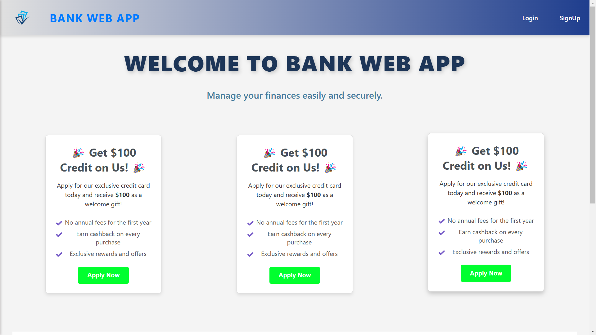
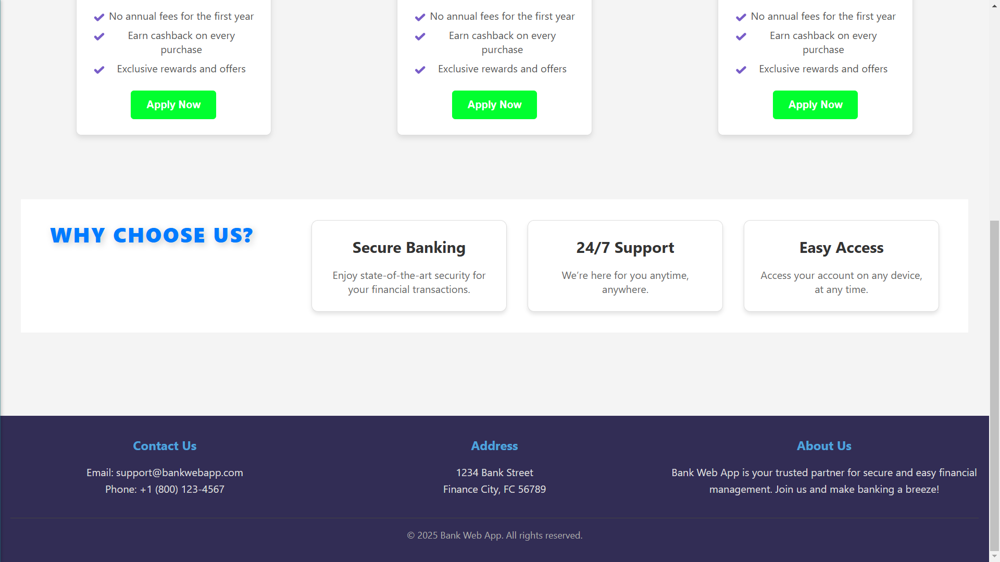
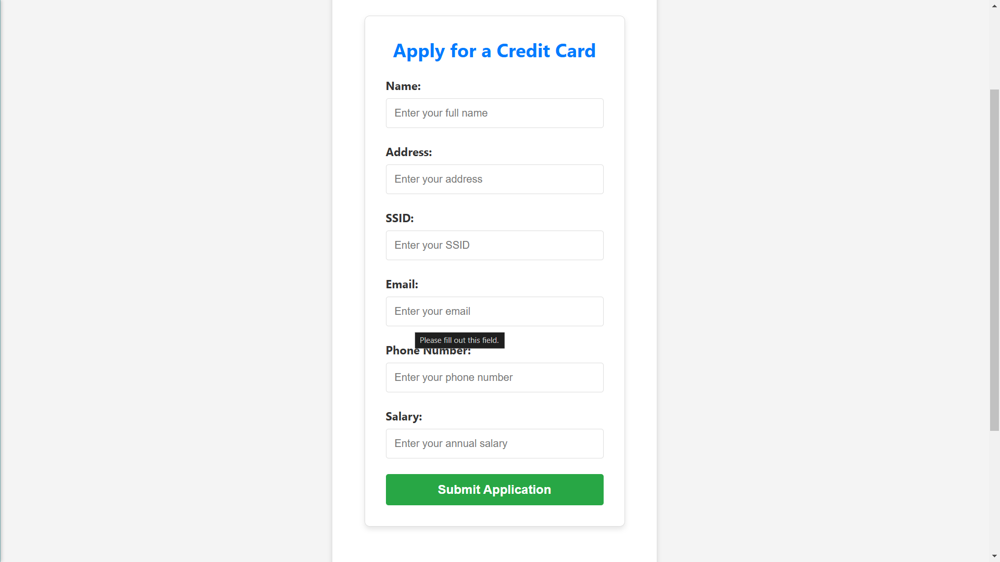

# BankWebApp

## Overview
**BankWebApp** is a modern banking application designed with a clean and responsive UI to provide essential banking functionalities. This project demonstrates core front-end development concepts using React.js and plans to expand with back-end APIs and advanced features in the future.

---

## Front-End Features
### Built With
- **React.js**: For a simple and modern user interface.
- **Responsive Design**: Supports both mobile and desktop modes.

### Key Components
- **Forms**:
  - Login
  - Sign Up
  - Credit Card Application
  - Deposit
  - Withdraw
  - View Transactions
- **UI Components**:
  - Header
  - Footer
  - Apply Credit Card Button

### APIs
- `/login`: Handles user login.
- `/createUser`: Facilitates user sign-up.
- More endpoints to be integrated as the project develops.

---

## Demo Screenshots
### Landing Page


### Landing Page Footer


### Login Page


### Sign Up Page


### Apply Credit Card Page


---

## Future Improvements
### Planned Features
1. **Complete Front-End**:
   - Enhance existing UI components for a polished look and feel.
2. **Back-End Integration**:
   - Develop RESTful APIs to connect front-end with back-end services.
3. **Investment Pages**:
   - Enable users to invest in stocks with a user-friendly dashboard.
4. **AI-Powered Insights**:
   - Implement Reinforcement Learning models to predict market trends and provide actionable insights.
5. **Additional Features**:
   - Notifications
   - Budget management tools
   - Multi-currency support

---

## How to Run
### Prerequisites
- Node.js installed on your machine
- A package manager (npm or yarn)

### Steps
1. Clone the repository:
   ```bash
   git clone https://github.com/yourusername/BankWebApp.git
   ```
2. Navigate to the project directory:
   ```bash
   cd BankWebApp
   ```
3. Install dependencies:
   ```bash
   npm install
   ```
4. Start the development server:
   ```bash
   npm start
   ```
5. Open your browser and navigate to `http://localhost:3000` to view the application.

---

## Contributing
Contributions are welcome! Please fork the repository and submit a pull request with your proposed changes.

---

## License
This project is licensed under the [MIT License](LICENSE).

---